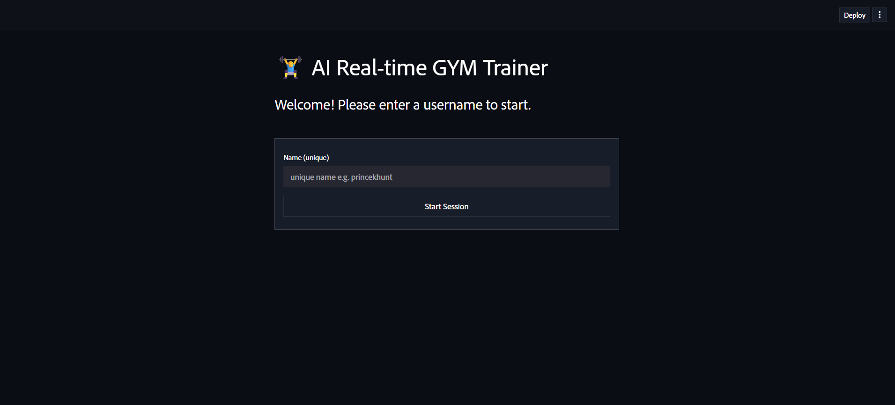
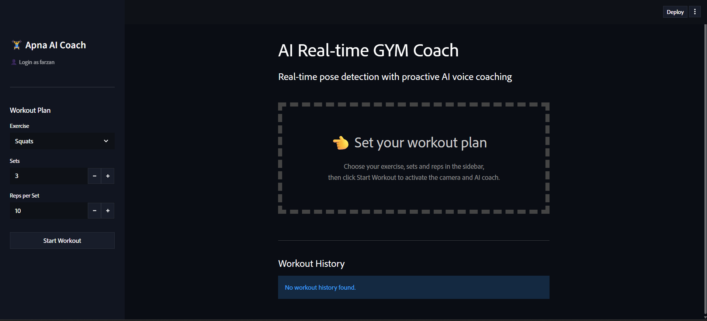
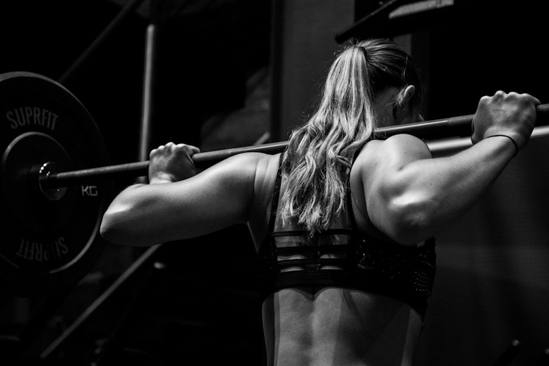

<div align="center">

# 🏋️ AI Gym Coach: Real-Time Biomechanical Form Correction & Proactive Voice Assistant

An edge-computed, full-stack fitness application combining computer vision, real-time kinematic trigonometry, and large language models to turn any webcam into an interactive personal trainer.

[](https://www.python.org/)
[](https://streamlit.io/)
[](https://ai.google.dev/edge/mediapipe/solutions/vision/pose_landmarker)
[](https://groq.com/)
[](https://opencv.org/)
[](https://www.sqlite.org/)
[](LICENSE)

[Key Features](#-key-features) • [Visual Showcase](#-visual-showcase--ui-walkthrough) • [System Architecture](#-system-architecture) • [Biomechanical Math](#-biomechanical-kinematics--detection-logic) • [Step-by-Step Setup](#-step-by-step-installation--execution-guide) • [Database Schema](#-database-architecture) • [Directory Map](#-repository-structure)


https://github.com/user-attachments/assets/27f4db0d-9372-4a38-9c86-26d3446be309


https://github.com/user-attachments/assets/5c0801ae-694c-49af-bdbf-1f02db3c40dc


</div>

---

## 📌 Executive Overview

Maintaining proper biomechanical form during compound and isolation resistance exercises is essential for neuromuscular adaptation and injury prevention. Most home exercisers lack access to real-time feedback, leading to technical breakdown such as lumbar hyperextension, kinetic chain misalignment, and partial range of motion.

**AI Gym Coach** solves this problem through an on-device, multi-stage AI pipeline:
1. **Low-Latency Video Ingestion**: Captures high-frame-rate browser video feeds using WebRTC.
2. **3D Pose Landmark Extraction**: Maps 33 spatial anatomical joints via Google MediaPipe.
3. **Deterministic Angle Trigonometry**: Computes joint articulation angles in real-time.
4. **Finite-State Machine Tracking**: Accurately registers repetition phases (`down` $\leftrightarrow$ `up`) without double-counting.
5. **Generative Voice Coaching**: Dispatches detected errors to Groq's high-speed inference engine running LLaMA 3.3 70B, which produces concise, motivational auditory corrections via text-to-speech.
6. **Longitudinal Progress Tracking**: Automatically logs volume metrics (sets, repetitions, elapsed time) to an embedded SQLite database.

---

## 📸 Visual Showcase & UI Walkthrough

### 1. Application Interface & Core Workflow

| User Authentication Wall | Workout Planning & Live Dashboard |
| :---: | :---: |
|  |  |

* **User Authentication Wall**: Simple identifier input to pull personal workout records from SQLite without password overhead.
* **Workout Configuration Sidebar**: Set exercise type, target set counts, and repetitions before camera activation.
* **Live Video Canvas**: Real-time WebRTC frame ingest showing MediaPipe 33-point landmarks, joint angle meters, and rep counts.
* **Historical Workout Ledger**: Tracks sets, reps, and elapsed time aggregated by date.

---

### 2. Product Landing Page & Video Walkthrough

| Feature Presentation Site | Biomechanical Motion Tracking |
| :---: | :---: |
|  |  |

#### 🎬 Landing Page Video Walkthrough
> **Local Video File:** [`LandingPage/videos_add_your_own/demo.mp4`](LandingPage/videos_add_your_own/demo.mp4)

<!-- *(To turn this into a playable embedded video on GitHub, see Step 4 below).* -->

<!-- ## 📸 Visual Showcase & UI Walkthrough

### 1. Product Landing Page & Video Demonstration

The project features a responsive dark-themed presentation portal engineered in vanilla HTML5 and CSS3 to showcase the platform's vision capabilities.

### Application Interface

| Login Wall | Workout Planning & Dashboard |
| :---: | :---: |
|  |  |

<!-- <div align="center">

| Product Presentation Portal | Animated Tracking Simulation |
| :---: | :---: |
|  |  |

</div> -->

#### 🎬 Live Demo Video
> The platform includes a pre-rendered high-definition demo video located at [`LandingPage/videos_add_your_own/demo.mp4`](LandingPage/videos_add_your_own/demo.mp4):

```html
<video width="100%" controls autoplay loop muted playsinline>
  <source src="LandingPage/videos_add_your_own/demo.mp4" type="video/mp4">
  Your browser does not support the video tag.
</video> -->
